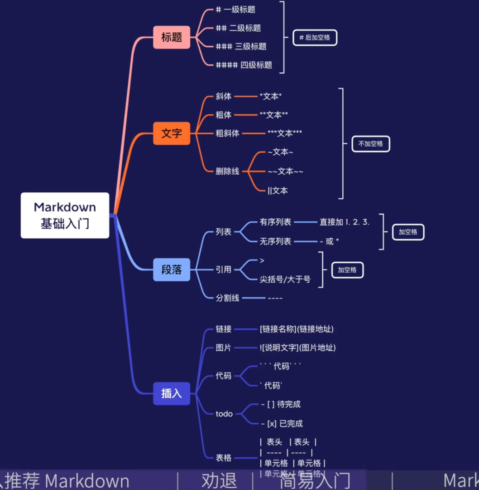
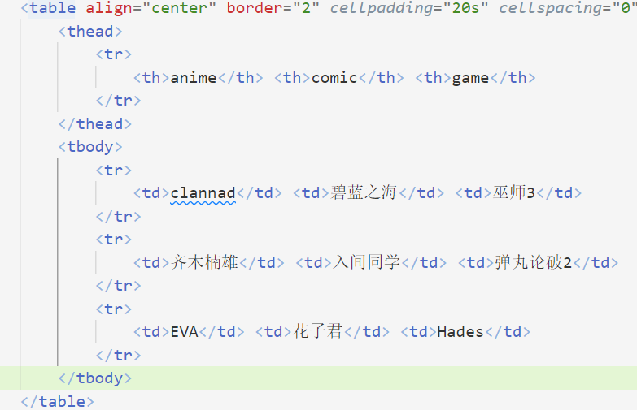
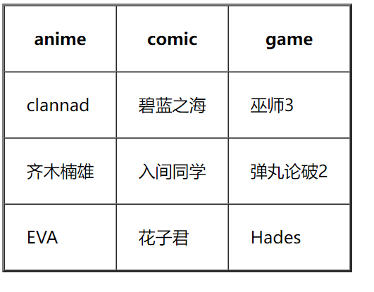
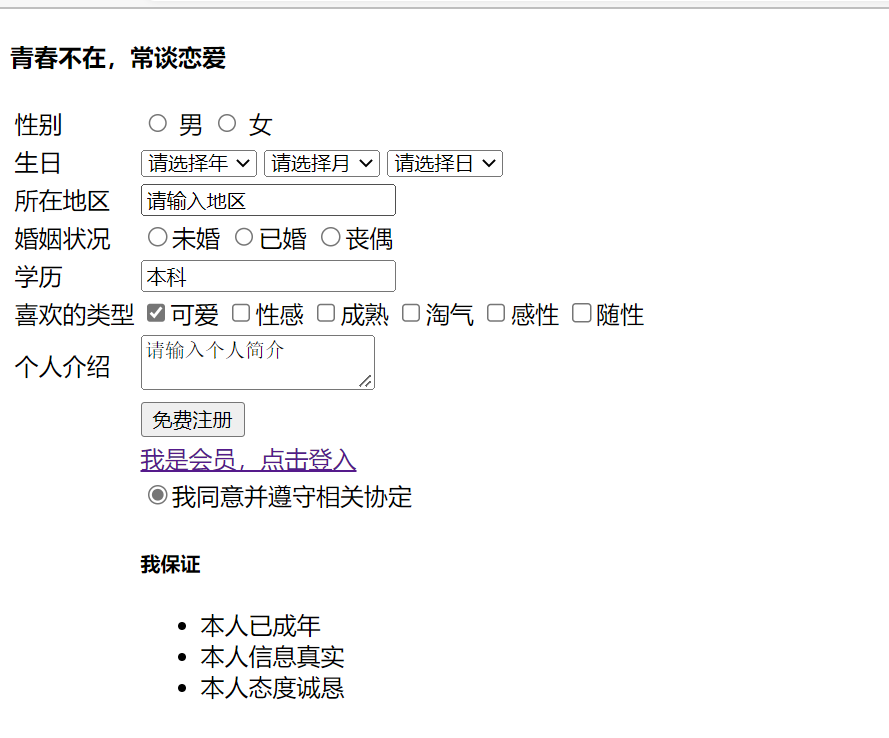

# HTML
---- 
###基础

----
***标签分单标签和双标签，
所有标签应用<>包含，结束时应添加/。***
----
|语言名|属性|解释|
|---|---|---|
|`<html> </html>`|HTML标签|页面中最大的标签，根标签|
|`<head> </head>`|文档的头部|head标签中必 须设置title|
|`<title> </title>`|文档的标题|让页面有一个属于 自己的标题|
|`<body> </body>`|文档的主体|该元素包含文档的所有内容，页面内容存于此处|
**常用单标签** 如：   ==`</br>`== ——换行
   ==`<image src="img.jpg"/>`==——图片
**文字属性标签**
==`<strong> </strong>`==或==`<b> </b>`==——加粗
==`<em> </em>`==或==`<i> </i>`==——倾斜
==`<del> </del>`==或==`<s> </s>`==——删除线
==`<ins> </ins>`==或==`<u /u>`==——下划线
**如**
`<del>` 寄了啊 `</del>`==——==~~寄了啊~~
> 一般用css设置文字属性和颜色

----
###图像
*规范*： ``
|属性|属性值|说明|
|---|---|---|
|==src==|图片路径|必须属性|
|==alt==|文本|替换文本，当文本不能显示时显示文字|
|==title==|文本|提示文本，鼠标放在图像上时显示文字|
|==width==|像素|设置图像宽度|
|==height==|像素|设置图像高度|
|==border==|像素|设置图像边框粗细|
eg:
``
> 未显示图像则呈下方示例


> 下方为正常显示 


###### 相对路径分类
1. 同一级路径       ``
2. 下一级路径  ==/== ``  
3. 上一级路径  ==../==  ``
  
  ----
### 超链接标签 

eg：`<a href="url" target="打开方式">文本或图像</a>`
- href 用于指定链接目标地址的url
- target 指定打开页面的方式，-self为当前页面（默认）,-blank为新窗口打开  
   
###### 链接分类（url）
1. 外部链接——https://www.bilibili.com/
2. 内部链接——D:\VSCODE\web\表格.html
3. 空链接——#
4. 下载链接——img.zip
5. 网页元素链接——eg:  <a href="二次元.html"></a>
> 此时点击该图片会跳转到另一个网页
6. 锚点链接 
eg：`<a href="#xxx">文本或图像</a>`
> 点击文本或图像后

将跳转至另一个标签如`<p id="xxx">文本</p>`
######注释标签
`<!--注释内容-->`
**快捷键——**==ctrl+/==

######特殊标签
- **空格** &nbsp
- **大于** &gt
- **小于** &lt

----
###表格
```
<table>
  <tr>
    <td>单元格内的文字</td>
    <td>...</td>
  </tr>
</table>         
```


==***相关说明***==
1. `<table></table>`是用于定义表格的标签
2. `<tr></tr>`定义表格中的行，必须位于`<table></table>`中
3. `<td></td>`表示单元格，必须位于`<tr></tr>`中
4. `<th></th>`为表头单元格，使其加粗居中
    
######表格属性
    <!--放于<table>中  -->
|属性名|属性值|描述|
|----|:----:|----|
|**align**|left、center、right|规定表格位置|   
|**border**|1或""|是否有边框，默认为""，表示无边框|  
|**cellpadding**|像素值|规定单元格边沿与其内容间的空白|  
|**cellspacing**|像素值|规定单元格之间的空白|  
|**width**|像素值或百分比|表格宽度|
> 表格属性不常用，一般用css调理  
 
==特别的有==
`<thead></thead>`为表格头部区域
`<tbody></tbody>`为表格主体区域
######合并
跨行合并：**rowspan="个数"**
跨列合并：
*==eg:==*
`<td rowspan=""></td>`
> 记得删去多余单元格 

----
###列表
######无序列表
```
<ul>
  <li>列表项1</li>
  <li>列表项2</li>
  <li>列表项3</li>
</ul>
```
######有序列表
```
<ol>
  <li>列表项1</li>
  <li>列表项2</li>
  <li>列表项3</li>
</ol>
```
> `<ol>和<ul>中只能嵌套<li>,<li>中可以嵌套任何标签`
######自定义列表
```
<dl>
  <dt>名词</dt>
  <dt>名词解释1</dt>
  <dt>名词解释2</dt>
</dl>
```
----
###表单
```
<form action="url" method="提交方式" name="表单域名称">
  .......  
</form>
  ```
###### 表单元素
input，select
eg：文本`<input type="属性值"/>`
- checkbox——复选框
- radio——单选框
- submit——提交
- password——密码框
- text——文本框
- reset——重置
- button——定义可点击按钮
- file——提供文件上传

***属性名***
- name——定义input的名称（单选，复选）
- value——规定input元素的值
- checked——打开页面时被选中
- maxlength——最大长度
  
***label标签***
> `<label>用于绑定(for,id)一个表单元素，当点击<label>标签内文本时，光标自动转移到对应元素`
```
<label for="sex">男</label>
<input type="radio" id="sex"/>
当点击男时，单选框会被选中。
```
***下辣表单***
```
<select>
  <option>选项1</option>
  <option>选项2</option>
  ......
</select>
```
> 默认属性 selected

***textarea***
==语法==：
```
<textarea>
文本内容
</textarea>
``` 
==eg==
```
<body>
    <h4>青春不在，常谈恋爱</h4>
    <table>
        <!--第一行-->
        <tr>
            <td>性别</td>
            <td>
                <input type="radio" name="sex" id="man"/> <label for="man">男</label>
                <input type="radio" name="sex" id="woman"/> <label for="woman">女</label>
            </td>
        </tr>
        <tr>
            <td>生日</td>
            <td>
                <select>
                    <option>请选择年</option>
                    <option>2003</option>
                    <option>2004</option>
                    <option>2005</option>
                </select>
                <select>
                    <option>请选择月</option>
                    <option>1</option>
                    <option>2</option>
                    <option>3</option>
                    <option>4</option>
                    <option>5</option>
                    <option>6</option>
                    <option>7</option>
                    <option>8</option>
                    <option>9</option>
                    <option>10</option>
                    <option>11</option>
                    <option>12</option>
                </select>
                <select>
                    <option>请选择日</option>
                    <option>21</option>
                    <option>14</option>
                    <option>02</option>
                </select>
            </td>
        </tr>
        <tr>
            <td>所在地区</td>
            <td><input type="text" value="请输入地区"/></td>
        </tr>
        <tr>
            <td>婚姻状况</td>
            <td><input type="radio" name="marry">未婚
                <input type="radio" name="marry">已婚
                <input type="radio" name="marry">丧偶
            </td>
        </tr>
        <tr>
            <td>学历</td>
            <td><input type="text" value="本科"/></td>
        </tr>
        <tr>
            <td>喜欢的类型</td>
            <td>
            <input type="checkbox" checked="checked"/>可爱
            <input type="checkbox"/>性感
            <input type="checkbox"/>成熟
            <input type="checkbox"/>淘气
            <input type="checkbox"/>感性
            <input type="checkbox"/>随性
            </td>
        </tr>
        <tr>
            <td>个人介绍</td>
            <td><textarea>请输入个人简介</textarea></td>
        </tr>
        <tr>
            <td></td>
            <td><input type="submit" value="免费注册"/></td>
        </tr>
        <tr>
            <td>

            </td>
            <td>
                <a href="#" target="_self">我是会员，点击登入</a>
            </td>
        </tr>
        <td></td>
        <td><input type="radio" checked/>我同意并遵守相关协定</td>
        <tr>
            <td></td>
            <td>
                <h5>我保证</h5>
                <ul>
                    <li>本人已成年</li>
                    <li>本人信息真实</li>
                    <li>本人态度诚恳</li>
                </ul>
            </td>
        </tr>
        
    </table>
</body>
```

----
